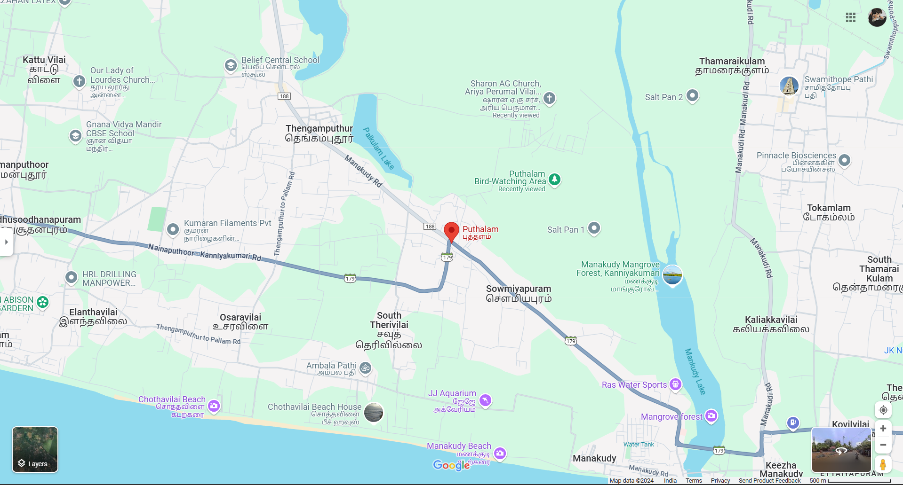
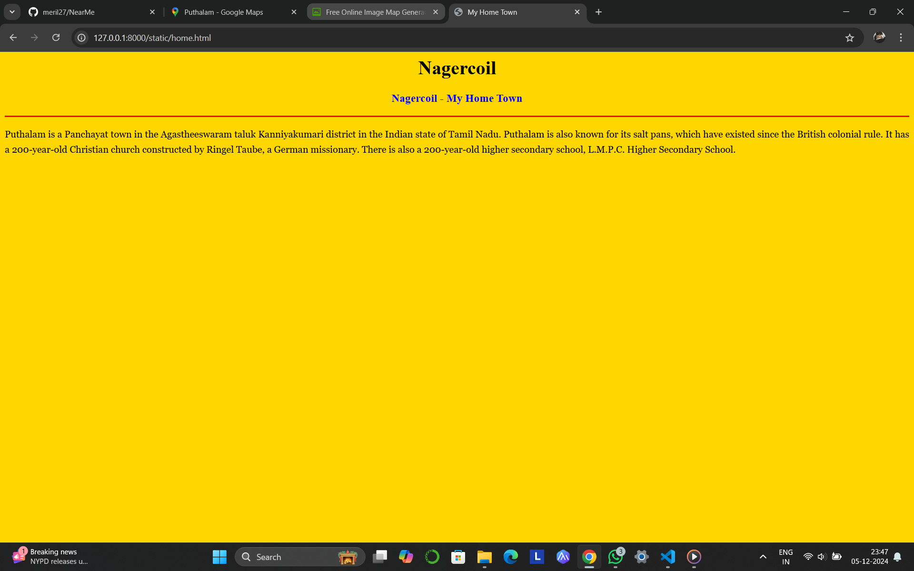
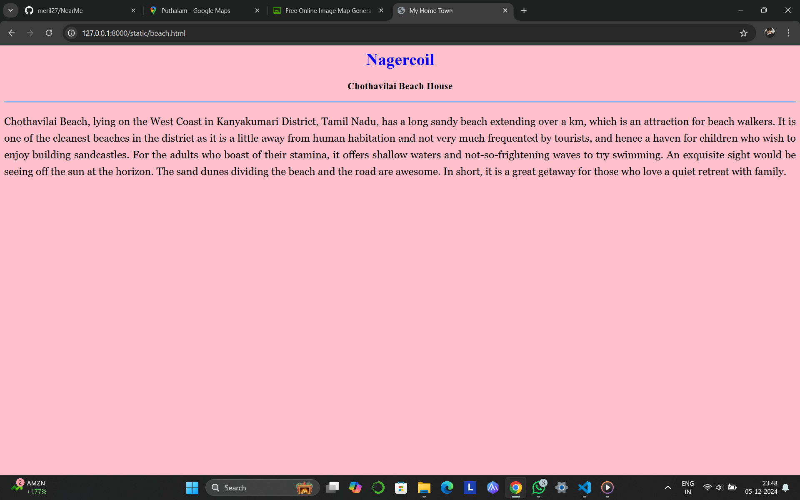
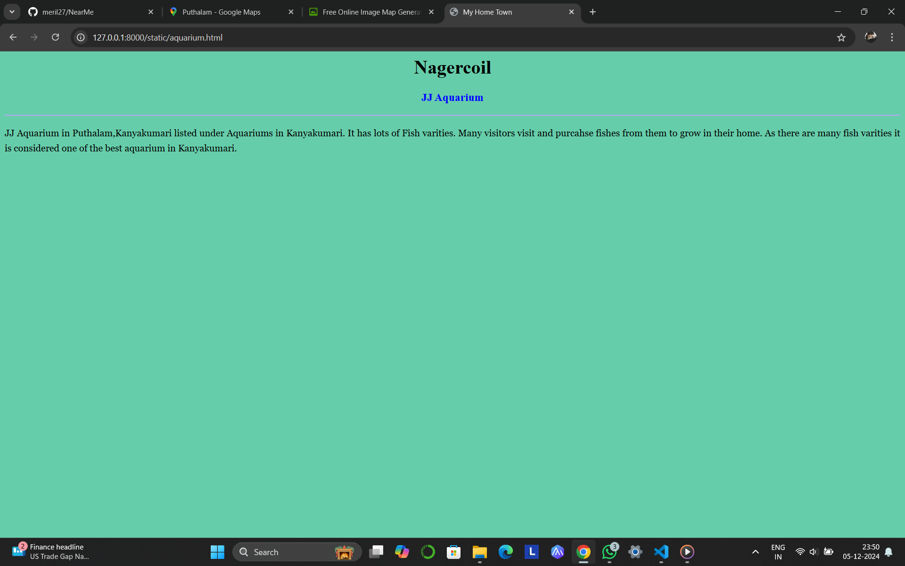
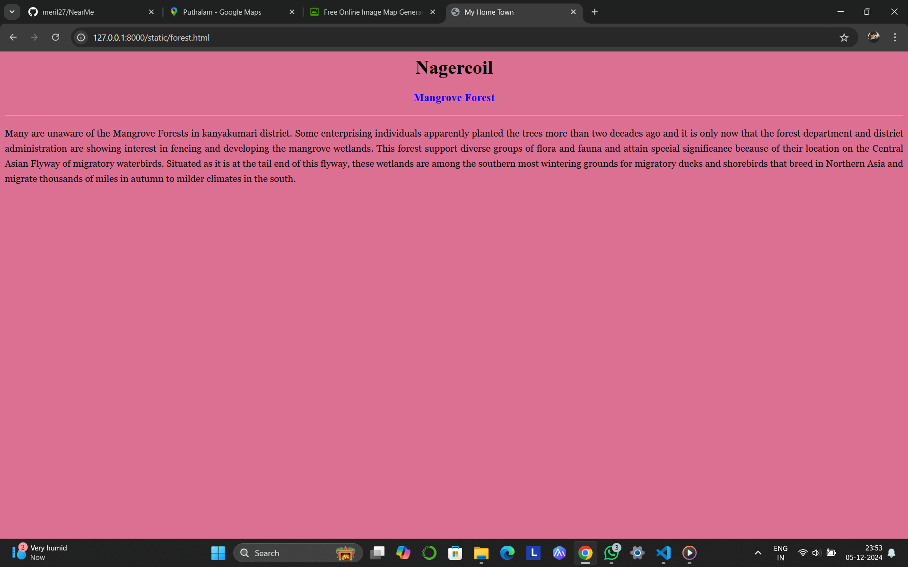
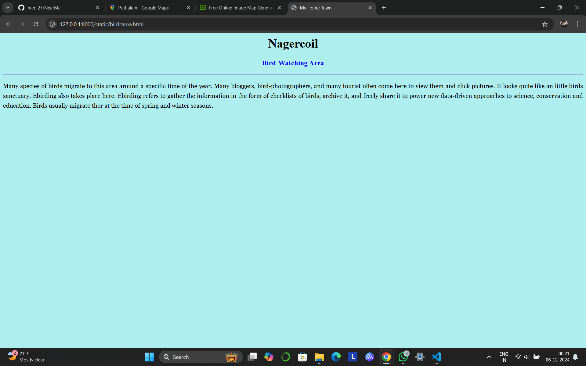

# Ex04 Places Around Me
## Date: 06.12.2024

## AIM
To develop a website to display details about the places around my house.

## DESIGN STEPS

### STEP 1
Create a Django admin interface.

### STEP 2
Download your city map from Google.

### STEP 3
Using ```<map>``` tag name the map.

### STEP 4
Create clickable regions in the image using ```<area>``` tag.

### STEP 5
Write HTML programs for all the regions identified.

### STEP 6
Execute the programs and publish them.

## CODE
'''
map.html

<html>
    <head>
        <title>My City</title>
    </head>
    <body>
        <h1 align="center">
            <font color="red"><b>Nagercoil</b></font>
        </h1>
        <h3 align="center">
            <font color="blue"><b>MERIL GOLDLINA A(24007299)</b></font>
        </h3>
        <center>
            
            <map name="MyCity">
            <area shape="rect" coords="700,250,840,300" href="home.html" title="My Home Town">
            <area shape="circle" coords="620,740,220,80" href="beach.html" title="Chothavilai Beach House">
            <area shape="circle" coords="1000,1200,840,300" href="aquarium.html" title="JJ Aquarium">
            <area shape="circle" coords="700,200,840,200" href="forest.html" title="Mangrove Forest">
            <area shape="rect" coords="500,100,900,900" href="birdsarea.html" title="Bird-Watching Area">
        </map>
        </center>
    </body>
</html>

home.html

<html>
    <head>
        <title>My Home Town</title>
    </head>
    <body bgcolor="gold">
        <h1 align="center">
            <font color="black"><b>Nagercoil</b></font>
        </h1>
        <h3 align="center">
            <font color="blue"><b>Nagercoil - My Home Town</b></font>
        </h3>
        <hr size="3" color="red">
        <p align="justify" style="font-family: Georgia; font-size: 20pCx; line-height: 1.6;">
            Puthalam is a Panchayat town in the Agastheeswaram taluk Kanniyakumari district in the Indian state of Tamil Nadu. Puthalam is also known for its salt pans, which have existed since the British colonial rule. It has a 200-year-old Christian church constructed by Ringel Taube, a German missionary. 
            There is also a 200-year-old higher secondary school, L.M.P.C. Higher Secondary School.
        </p>
    </body>
</html>

beach.html

<html>
    <head>
        <title>My Home Town</title>
    </head>
    <body bgcolor="pink">
        <h1 align="center">
            <font color="blue"><b>Nagercoil</b></font>
        </h1>
        <h3 align="center">
            <font color="black"><b>Chothavilai Beach House</b></font>
        </h3>
        <hr size="3" color="navyblue">
        <p align="justify" style="font-family: Georgia; font-size: 20px; line-height: 1.6;">
            Chothavilai Beach, lying on the West Coast in Kanyakumari District, Tamil Nadu, has a long sandy beach extending over a km, which is an attraction for beach walkers. It is one of the cleanest beaches in the district as it is a little away from human habitation and not very much frequented by tourists, and hence a haven for children who wish to enjoy building sandcastles.
            For the adults who boast of their stamina, it offers shallow waters and not-so-frightening waves to try swimming. An exquisite sight would be seeing off the sun at the horizon. The sand dunes dividing the beach and the road are awesome. In short, it is a great getaway for those who love a quiet retreat with family.
        </p>
        </body>
</html>

aquarium.html

<html>
    <head>
        <title>My Home Town</title>
    </head>
    <body bgcolor="mediumaquamarine">
        <h1 align="center">
            <font color="black"><b>Nagercoil</b></font>
        </h1>
        <h3 align="center">
            <font color="blue"><b>JJ Aquarium</b></font>
        </h3>
        <hr size="3" color="navyblue">
        <p align="justify" style="font-family: Georgia; font-size: 20pCx; line-height: 1.6;">
            JJ Aquarium in Puthalam,Kanyakumari listed under Aquariums in Kanyakumari. It has lots of Fish varities. Many visitors visit and purcahse fishes from them to grow in their home.
            As there are many fish varities it is considered one of the best aquarium in Kanyakumari.
        </p>
    </body>
</html>

forest.html

<html>
    <head>
        <title>My Home Town</title>
    </head>
    <body bgcolor="palevioletred">
        <h1 align="center">
            <font color="black"><b>Nagercoil</b></font>
        </h1>
        <h3 align="center">
            <font color="blue"><b>Mangrove Forest</b></font>
        </h3>
        <hr size="3" color="navyblue">
        <p align="justify" style="font-family: Georgia; font-size: 20pCx; line-height: 1.6;">
            Many are unaware of the Mangrove Forests in kanyakumari district. Some enterprising individuals apparently planted the trees more than two decades ago and it is only now that the forest department and 
            district administration are showing interest in fencing and developing the mangrove wetlands. This forest support diverse groups of flora and fauna and attain special significance because of their location 
            on the Central Asian Flyway of migratory waterbirds. Situated as it is at the tail end of this flyway, these wetlands are among the southern most wintering grounds for migratory ducks and shorebirds that 
            breed in Northern Asia and migrate thousands of miles in autumn to milder climates in the south.
        </p>
        </body>
</html>

birdsarea.html

<html>
    <head>
        <title>My Home Town</title>
    </head>
    <body bgcolor="paleturquoise">
        <h1 align="center">
            <font color="black"><b>Nagercoil</b></font>
        </h1>
        <h3 align="center">
            <font color="blue"><b>Bird-Watching Area</b></font>
        </h3>
        <hr size="3" color="navyblue">
        <p align="justify" style="font-family: Georgia; font-size: 20pCx; line-height: 1.6;">
            Many species of birds migrate to this area around a specific time of the year. Many bloggers, bird-photographers, and many tourist often come here to view them and click pictures. It looks quite like an little birds sanctuary.
            Ebirding also takes place here. Ebirding refers to gather the information in the form of checklists of birds, archive it, and freely share it to power new data-driven approaches to science, conservation and education. Birds usually migrate ther at the time of spring and winter seasons.
        </p>
        </body>
</html>
'''

## OUTPUT








## RESULT
The program for implementing image maps using HTML is executed successfully.
